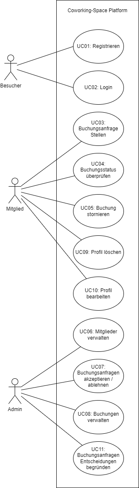
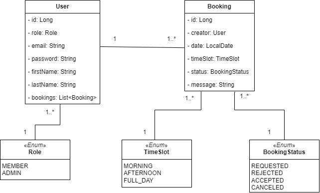
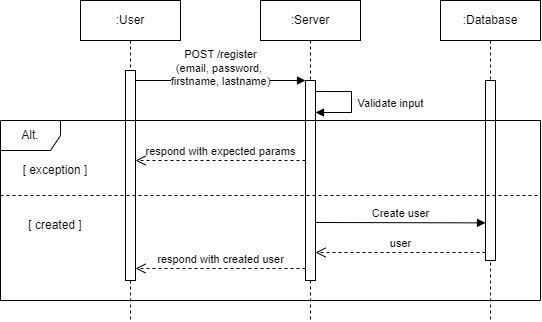

# Dokumentation

## Erweiterte Anforderungen

### Zusätzliche funktionale Anforderungen

**UC09**: Als Mitglied möchte ich mein **Profil löschen** können, um meine Daten zu entfernen. \
**UC10**: Als Mitglied möchte ich mein **Profil bearbeiten** (E-Mail-Adresse, Passwort, Vorname, Nachname) können, um
meine Daten zu
aktualisieren. \
**UC11**: Als Administrator möchte ich die Buchunsanfragen **mit einer Begründung** ablehnen oder annehmen können, um
die Entscheidung zu begründen.

### Zusätzliche nicht-funktionale Anforderungen

**NF06**: Das JWT besitzt einen Spielraum von 5 Minuten, in denen der **abgelaufene Token noch gültig** ist. (Leeway) \
**NF07**: Die Antwortzheit der API beträgt maximal **1s**, um die Benutzerfreundlichkeit zu gewährleisten. \
**NF08**: Der **Datenbankzugriff** erfolgt über eine **ORM**, um die sichere Datenhaltung zu gewährleisten.

## Persona

| Role          | Name                  | Alter | Geschlecht | Beruf                                                  | Motivation                                                                                          | Bild                         |
|---------------|-----------------------|-------|------------|--------------------------------------------------------|-----------------------------------------------------------------------------------------------------|------------------------------|
| Besucher      | Lukas Vertriebsleiter | 42    | Männlich   | Vertriebsleiter in einem mittelständischen Unternehmen | Lukas ist auf der Suche nach einem Ort, wo er seine Kundengespräche professionell durchführen kann. |  |
| Mitglied      | Anna Studentin        | 24    | Weiblich   | Studentin an der Hochschule                            | Anna möchte einen ruhigen Ort zum Lernen und Arbeiten finden.                                       |    |
| Administrator | Max Administrator     | 35    | Männlich   | Administrator des Coworking-Space                      | Max möchte die Buchungsanfragen schnell und effizient bearbeiten können.                            |      |

## Anwendungsfalldiagramm

## Fachklassendiagramm

## Schnittstellenplanung

### Auth Endpoints

| Methode | Pfad      | Beschreibung                                                                             | Erfolg- oder Fehlerszenario                               | Rückgabewert                      |
|---------|-----------|------------------------------------------------------------------------------------------|-----------------------------------------------------------|-----------------------------------|
| POST    | /register | Registriert den Benutzer mit den übergebenen Daten (E-Mail, Passwort, Vorname, Nachname) | Erfolg: 201 Created, Fehler: 400 Bad Request              | Nichts                            |
| POST    | /login    | Authentifizierung eines Benutzers                                                        | Erfolg: 200 OK, Fehler: 401 Unauthorized, 400 Bad Request | JWT-Token im Authorization-Header |

### User Endpoints

Bei all diesen Endpoints muss der Benutzer authentifiziert sein und die richtigen Berechtigungen besitzen.

| Methode | Pfad        | Beschreibung                                   | Erfolg- oder Fehlerszenario                            | Rückgabewert        |
|---------|-------------|------------------------------------------------|--------------------------------------------------------|---------------------|
| GET     | /users      | Gibt alle Benutzer zurück (nur für Admins)     | Erfolg: 200 OK                                         | Liste von Benutzern |
| POST    | /users      | Erstellt einen neuen Benutzer (nur für Admins) | Erfolg: 201 Created, Fehler: 400 Bad Request           | Nichts              |
| PATCH   | /users/{id} | Aktualisiert den Benutzer. {id} ist die UserID | Erfolg: 200 OK, Fehler: 400 Bad Request, 404 Not Found | Nichts              |
| DELETE  | /users{id}  | Löscht den Benutzer. {id} ist die UserID       | Erfolg: 204 No Content                                 | Nichts              |

### Booking Endpoints

Bei all diesen Endpoints muss der Benutzer authentifiziert sein und die richtigen Berechtigungen besitzen.

| Methode | Pfad               | Beschreibung                                                        | Erfolg- oder Fehlerszenario                                           | Rückgabewert        |
|---------|--------------------|---------------------------------------------------------------------|-----------------------------------------------------------------------|---------------------|
| GET     | /bookings          | Gibt alle Buchungen zurück (nur für Admins)                         | Erfolg: 200 OK                                                        | Liste von Buchungen |
| GET     | /bookings/{userId} | Gibt alle Buchungen eines Benutzers zurück. {userId} ist die UserID | Erfolg: 200 OK, Fehler: 403 Forbidden                                 | Liste von Buchungen |
| POST    | /bookings          | Erstellt eine neue Buchung                                          | Erfolg: 201 Created, Fehler: 400 Bad Request                          | Nichts              |
| PATCH   | /bookings/{id}     | Aktualisiert die Buchung. {id} ist die BookingID                    | Erfolg: 200 OK, Fehler: 400 Bad Request, 404 Not Found, 403 Forbidden | Nichts              |
| DELETE  | /bookings/{id}     | Löscht die Buchung. {id} ist die BookingID                          | Erfolg: 204 No Content, Fehler: 403 Forbidden                         | Nichts              |

## Sequenzdiagramm

## Versionierung